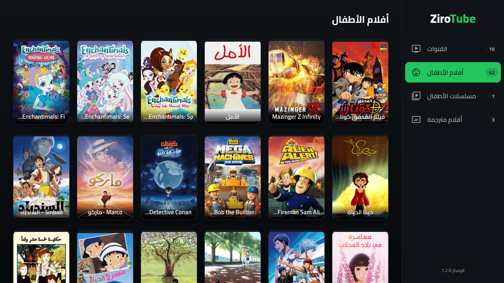
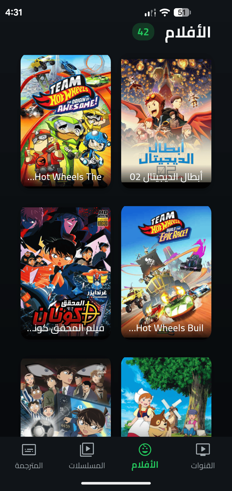

<p align="center">
  <a href="https://zirotube.pages.dev">
    
  </a>
</p>

<h1 align="center">ZiroTube</h1>

<p align="center">
  <strong>An open-source, ad-free streaming platform that provides a safe video experience for children on Android phones and Android TV.</strong>
</p>

<p align="center">
  
  
  
  
</p>

<p align="center">
  <a href="https://zirotube.pages.dev"><strong>Website</strong></a> •
  <a href="https://github.com/ziroo-cf/zirotube/releases/latest/download/ZiroTube-mobile.apk"><strong>Android</strong></a> •
  <a href="https://github.com/ziroo-cf/zirotube/releases/latest/download/ZiroTube-TV.apk"><strong>Android TV</strong></a>
</p>

---

## Overview

ZiroTube is an open-source, ad-free streaming platform designed to provide a safe and simple viewing experience for children. It includes dedicated interfaces for Android phones and Android TV while sharing a single Flutter codebase.

## Features

- 📱 Dedicated Android mobile interface
- 📺 Dedicated Android TV interface
- 🚫 Completely ad-free experience
- 👶 Safe content for children
- ▶️ External playback using Just Player
- ☁️ Supabase backend
- ⚡ Lightweight and optimized for low-end devices
- ❤️ Open source

## Screenshots

| Android TV | Mobile |
|------------|--------|
|  |  |

## Downloads

| Platform | Download |
|----------|----------|
| 📱 Android | **[Download APK](https://github.com/ziroo-cf/zirotube/releases/latest/download/ZiroTube-mobile.apk)** |
| 📺 Android TV | **[Download APK](https://github.com/ziroo-cf/zirotube/releases/latest/download/ZiroTube-TV.apk)** |

## Website

Visit the official website:

**https://zirotube.pages.dev**

## Project Structure

```text
zirotube/
├── app/          # Flutter application
├── scraper/      # Content scraper
├── website/      # Landing page
├── docs/         # README assets
├── LICENSE
└── README.md
```

## Components

| Directory | Description |
|-----------|-------------|
| **app/** | Flutter application for Android and Android TV |
| **scraper/** | Tools for collecting and updating content |
| **website/** | Official landing page |
| **docs/** | Images used in the documentation |

## Documentation

| Guide | Description |
|-------|-------------|
| [app/README.md](app/README.md) | Build, run, and develop the Flutter application |
| [scraper/README.md](scraper/README.md) | Configure and run the content scraper |

## Technologies

- Flutter
- Dart
- Python
- Supabase

## Status

🚧 This project is under active development.

## License

This project is licensed under the **MIT License**. See the [LICENSE](LICENSE) file for details.
